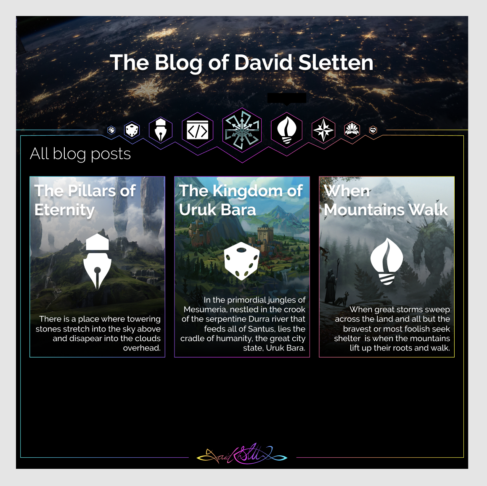
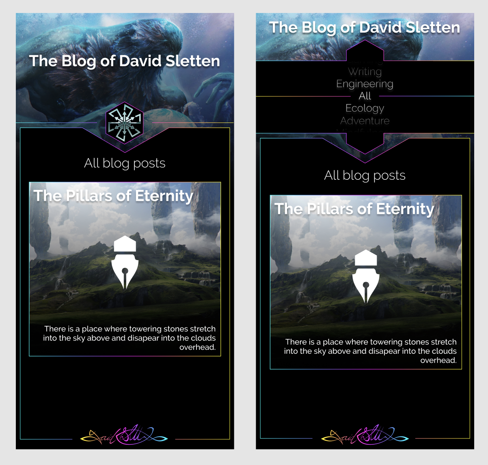
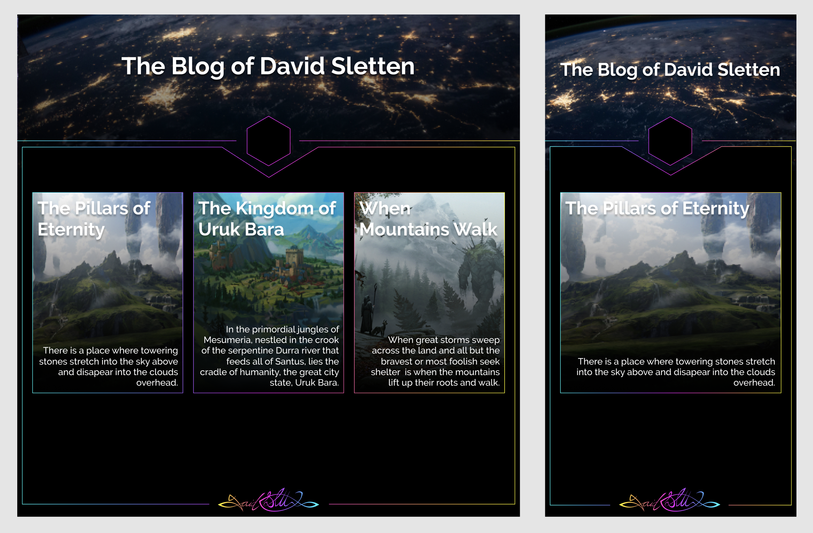
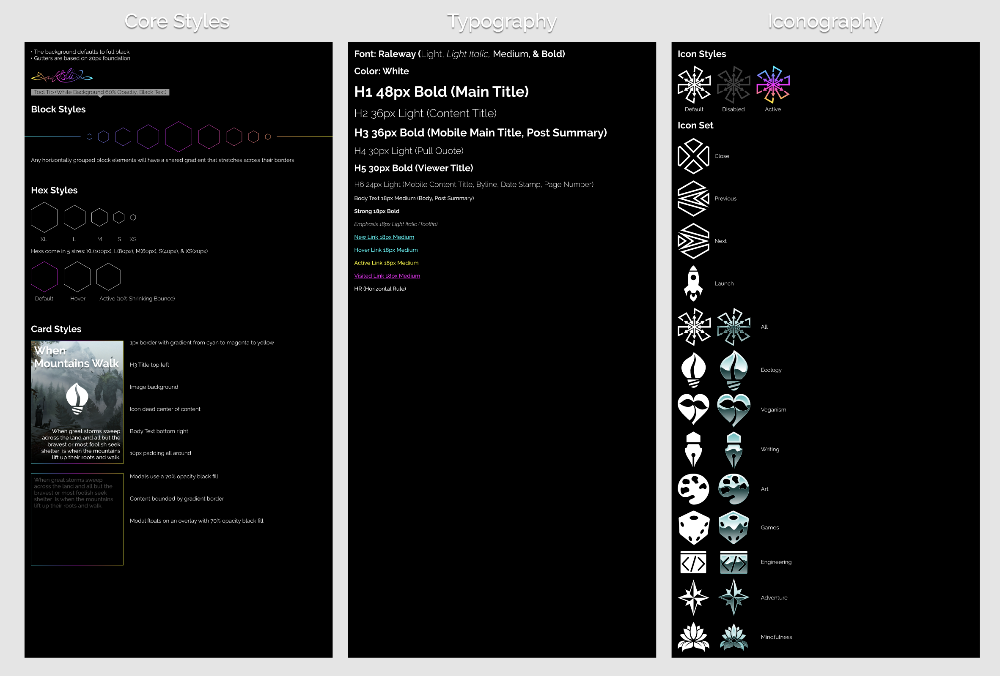

This blog has been in development for a year now. It's taken this long because I've limited my work on it to short daily sessions that I've scheduled into a packed daily routine. I wanted to use it to rebrand myself professionally and explore new styles and patterns. To begin I thought about a high level aesthetic that would capture my personality and interests. Something that has really caught my attention in recent years is retro futurism. This is an aesthetic that has really gained popularity and as a child of the eighties it speaks to the childhood awe I held for the future.

The way I decided to capture retro futurism was to boil it down to a few simple principles. I created neon color gradients that use the basic secondaries of cyan, magenta, and yellow. I applied these colors to thin lines reminiscent of early computer graphics and chose full black backgrounds. I experimented with chrome treatments for a set of custom icons but realized my initial organizational concept was too rigid. The icons were used for topic categories that would be hard coded into the navigation and the more I thought about it the more I dreaded locking myself into those fixed categories.

I abandoned parts of the design and simplified a bit but it's possible that I can still incorporate some of the elements I developed. It was really fun to re-brand and design a style guide and site mocks since it's been so many years since I did this professionally.

