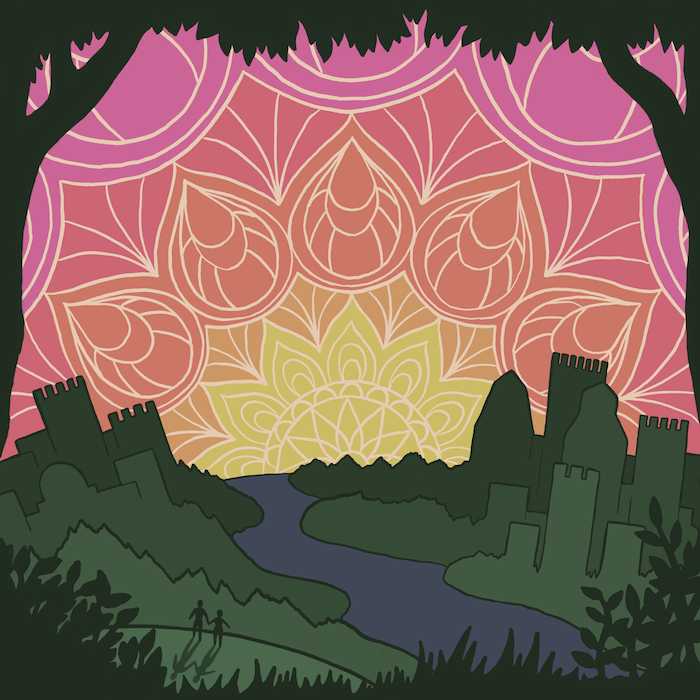
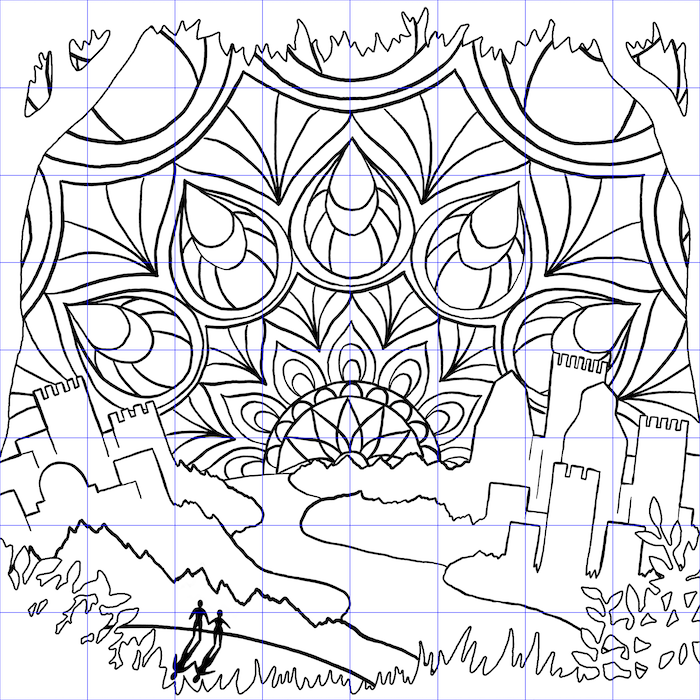
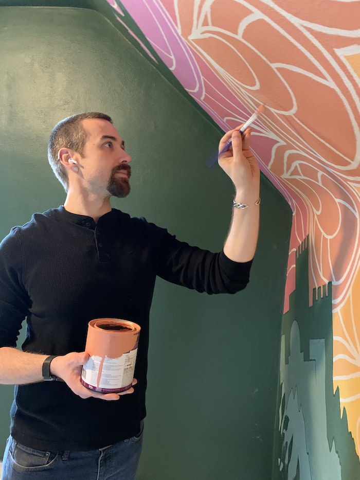
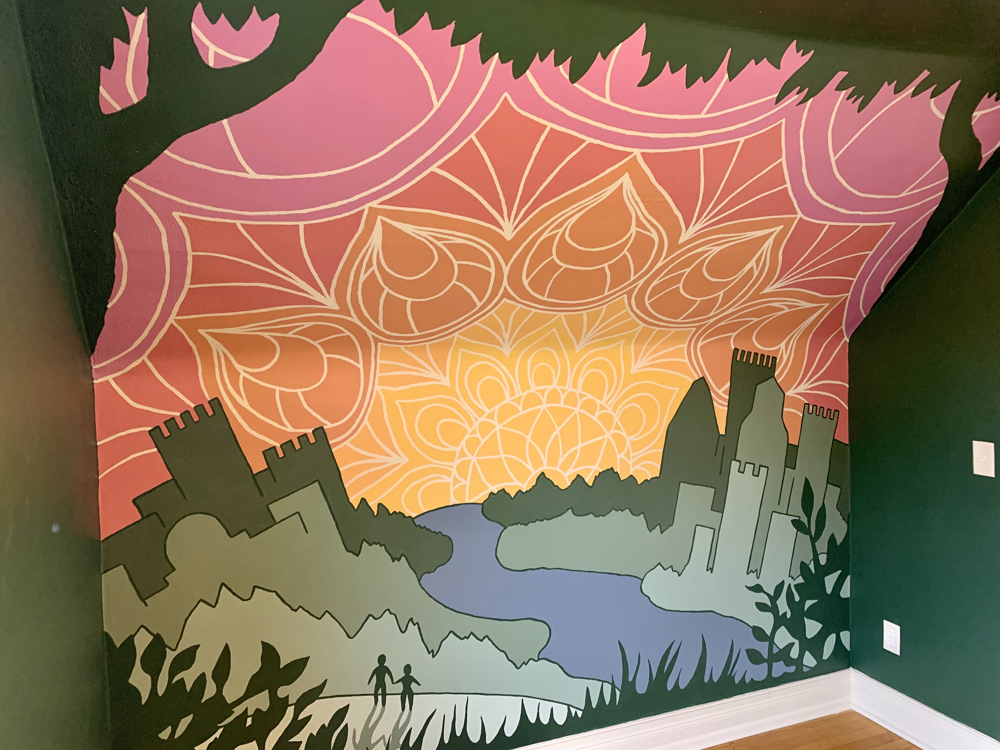

One of the projects that I'm proudest of is the mural that I created for my son's nursery. It started maybe six months before he was born when a good friend who was also planning for his first born shared the idea. Brilliant! I shamelessly stole it and began planning my own.

This was an intimidating project for me because I've never felt confident about my illustration skills and though drawing is something I've always loved, it's also one of the skills I've never dedicated the time to really reach my potential. I already had a great idea but needed to manifest it. I wanted to create a vista that made it appear as though the dark green of the rest of the nursery ended at a forest edge that bordered a view of our home, the twin cities of Minneapolis/St Paul, from our part of town as if looking on from high above.

I also wanted to create something magical and fantastical. An interpretation of our landscape that transformed the skylines of the cities into castles and the sky into a mystic mandala. It was a little tricky to plan the shape of the skylines so they would accurately represent the angle from NE Minneapolis but with the help of street view and a little driving around I had it decided.

I really struggled with how to divide the skylines from the landscape until I decided not to and instead went with an approach that incorporated them into a series of layered silhouettes that simplified the whole piece into nice blocks of color that would be better for a mural. One of the developments that I really liked was deciding to warp the horizon line into a fish eye bulge that makes it feel a bit more fantastical.

After finishing the line work I worked for a while on the colors. I wanted to limit the palette to support the final work of painting it on the wall but also create something vibrant and colorful that would be cohesive and fit the dark green we chose for the nursery. In the end there was a little bit lost in translation to paint, especially with the progression in shades of green but I'm happy with how it turned out.

Once I was satisfied with the design and colors I had to figure out how to actually realize my vision on the wall of the nursery. The wall I was planning to paint bent at a 45 degree angle half way up and I had planned for this with the positioning of the tops of the skyline but it meant that the transfer would have to be by hand with a grid instead of with a projector. I modified the design to isolate the line work and grid it out.

Drawing it on the wall was challenging but made much easier by breaking it down into the grid squares. I printed them out individually and used a nice soft pencil that worked well with the uneven texture. Once transferred, it was time to paint! It took forever... A lot longer than I thought it would but I tried to put in a little bit of time everyday to continue to make incremental progress. At first I started with the line work in the landscape and then did the fills but my wife had the idea to start with the fills and finish with the lines for the sky which turned out to be easier for nice crisp lines.

The final results are stunning and create a magical space for our son to call his own.

