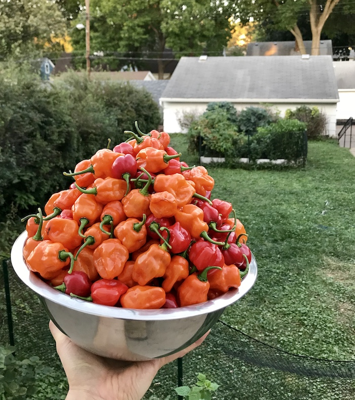
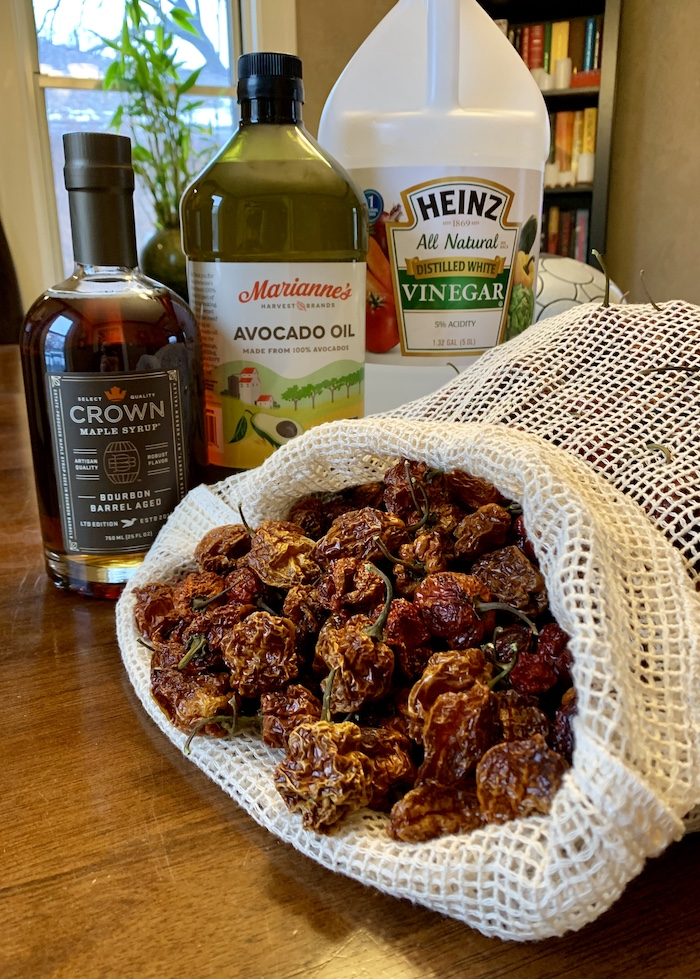
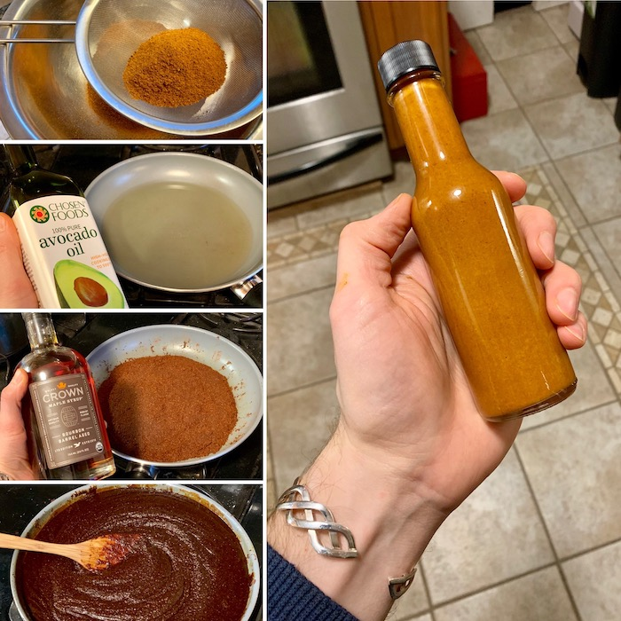
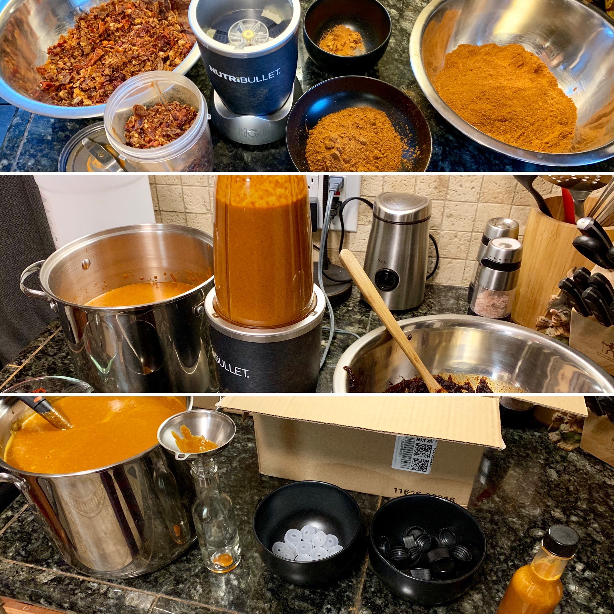
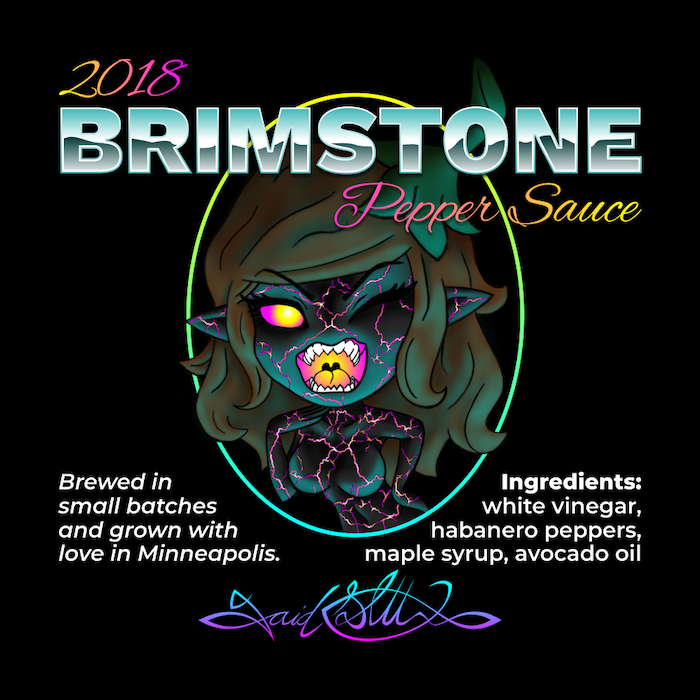
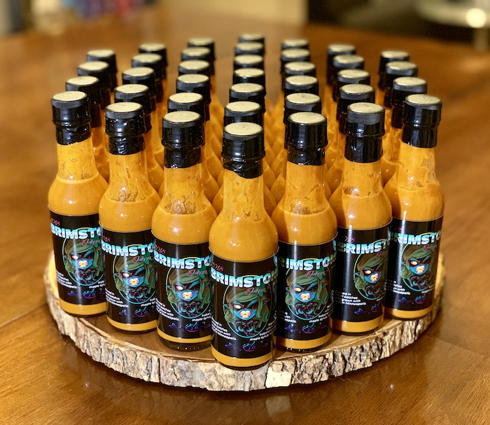

Perfected through years of failure, Brimstone Pepper Sauce is a project that captures my love of spicy food, offers an opportunity to explore product branding, and honors the legacy of my father who taught me the way of the pepper.

2018 was the year that Brimstone grew out of the amateur attempts of the first few years that I brewed pepper sauce. My first attempt went comically wrong when I chose coconut oil to sauté my peppers in and then, because coconut oil solidifies when it cools, my sauce hardened within the bottles… Disaster. I salvaged by mixing it down with another type of oil but it ended up a bit lumpy, not the best consistency for a sauce.

A couple years later I had tried enough and failed enough to feel confident. I also upped my garden game and focused exclusively on habanero peppers. I wanted my sauce to be exceptionally strong and simple but still distinct. My final recipe has only four ingredients: white vinegar, habanero peppers, maple syrup, and avocado oil.

The maple syrup hits the tongue with a sweet note that is followed immediately by the heavy hit of habanero. This batch was brilliant. A wonderful success that received praise from everyone who tasted it. I managed to brew fifty bottles and gave them away to friends and family.

I also stepped up the branding with the 2018 batch and put some time into illustrating and designing a label that I had professionally printed instead of printing at home. My label features an impish embodiment of a habanero pepper that plays off the brimstone brand. This was also around the time that I was rebranding my own identity for this blog and deciding on retro-futurism so I went with the chrome type treatment and neon colors of 80s sci-fi.

Brimstone has become an ongoing expression of my love for growing and nurturing plants, brewing and tweaking sauces, branding and designing packaging, and finally bringing a heavy spiciness to many of my favorite dishes.

