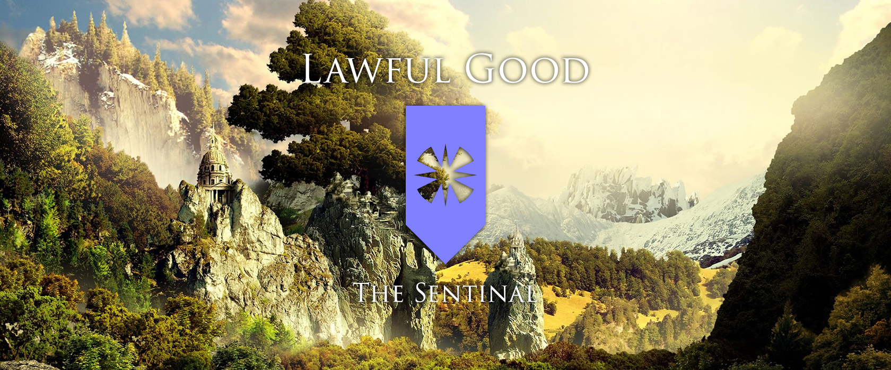
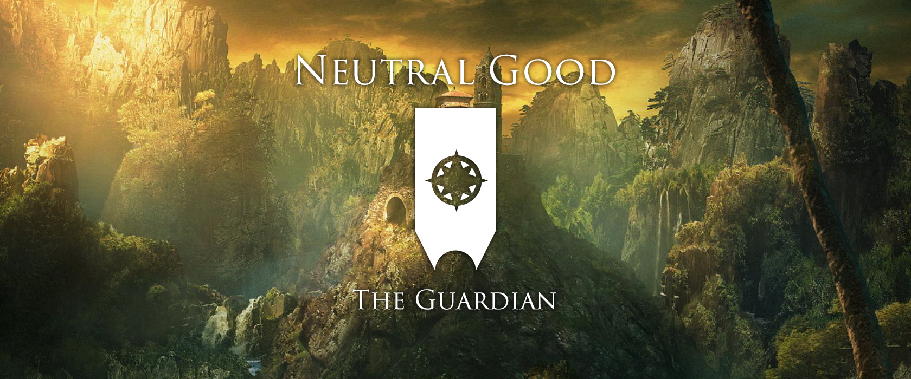
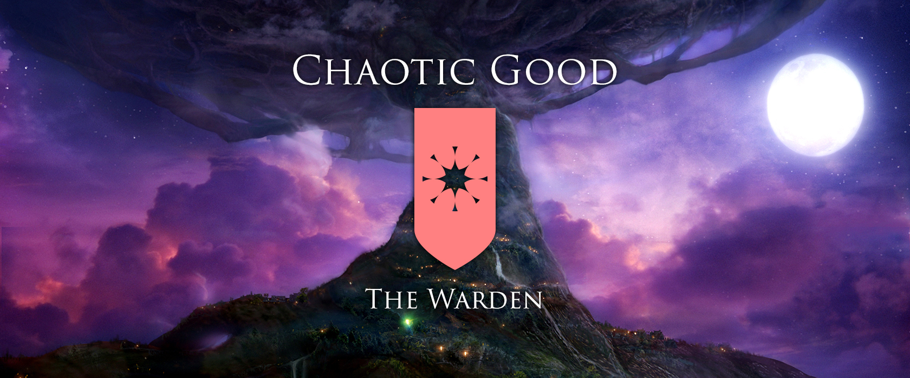
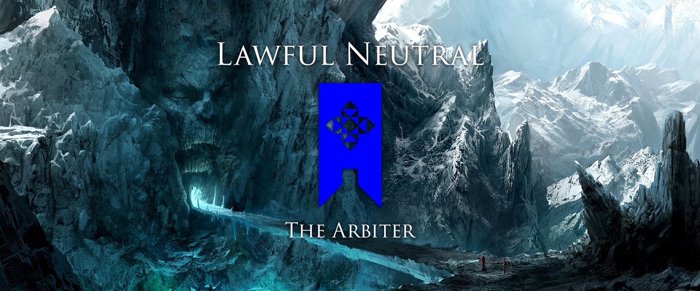
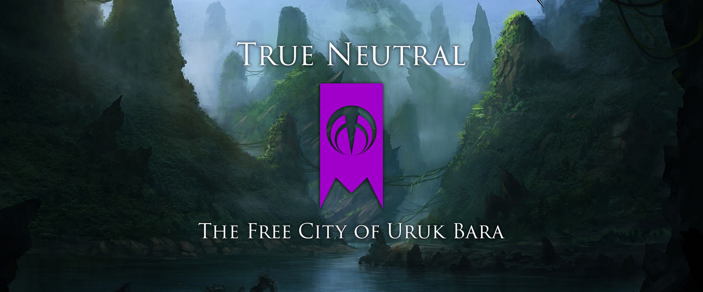
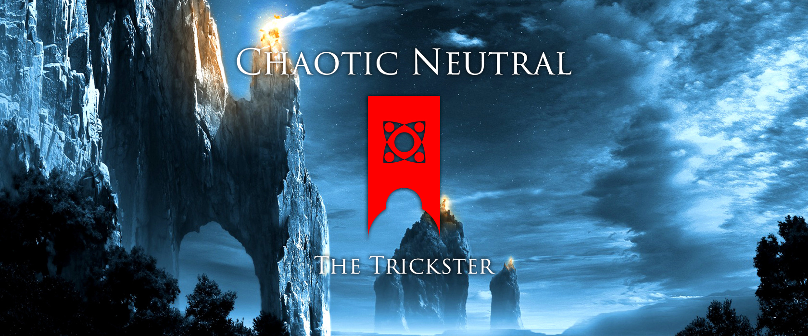
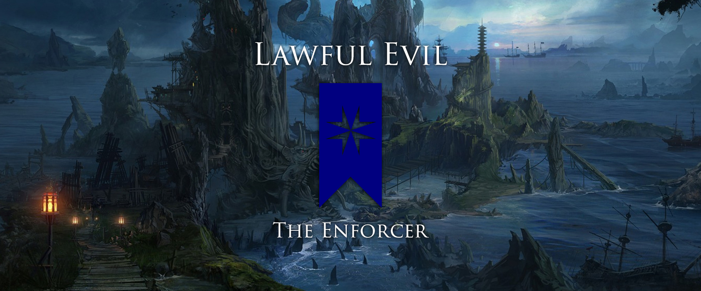
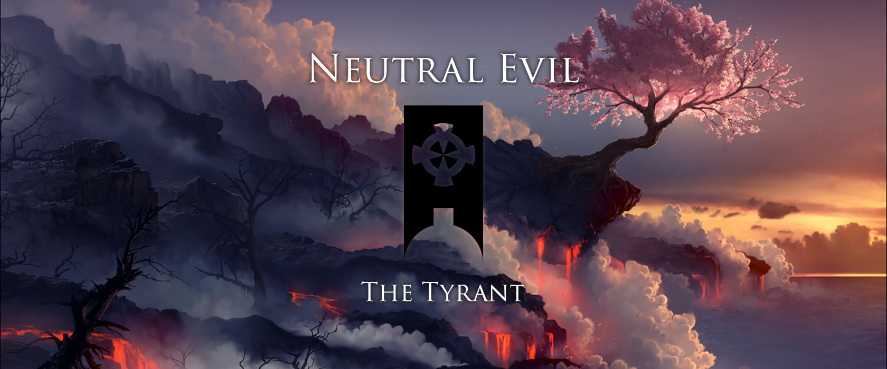
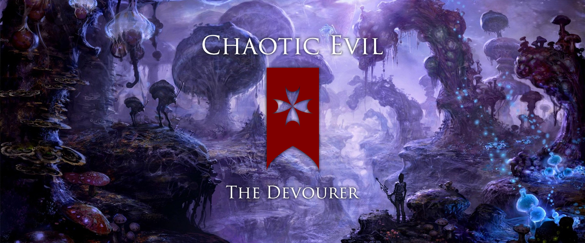

Dungeons & Dragons is more than a game for me. It is a community, a hobby, a social framework, and also a context for creative expression. A few years ago I was just finishing a novella I had been writing when the fifth edition of D&D was released and I was looking for a new creative project. I had been playing D&D for many years by this point and been running games as Dungeon Master as well but always used fictional worlds created by others. I decided it was time to create my own campaign setting for D&D.

This was a wonderful creative project and took me more than a year to complete. The framework that D&D provides offers so many rich options but also interesting constraints that helped to frame the scope of creating an entire fictional world. One of my favorite parts of world building is creating balanced systems that give an order to my worlds that reality lacks while still allowing chaos and flexibility. 

I latched on to the alignment system as the foundation to build my world. The alignment system of D&D is a combination of two axis that define a character’s world view and moral framework. One axis is lawful/neutral/chaotic while the other is good/neutral/evil. These combine to create nine unique alignments with true neutral at the center. I decided to create nine factions and nine realms that represent each of these alignments.

This concept gave me a system to found my campaign setting and from there I was able to divide and customize the many races, monsters, and concepts of D&D to flesh out each of these realms. Most fantasy settings use a medieval context but I was really interested in the idea of a truly ancient, primordial world of burgeoning civilizations, epic beasts, and breathtaking surroundings.

I started with a creation myth and then worked my way through each faction one at a time, writing their history, society, and environment as well as a number of examples of specific ways a character can be created from their culture. Each faction became a world of its own and when woven together they create the most thoroughly realized fictional world that I’ve ever created.

The culmination of my world building project was the creation of [primordias.com](http://primordias.com/), a site that I designed and developed to showcase and access the lore I created for my world. It includes a number of beautiful landscape illustrations that are not my own but I am not using it in any official or professional capacity. The iconography and emblems are all my creations and helped me to define the style and spirit of each of my factions.

