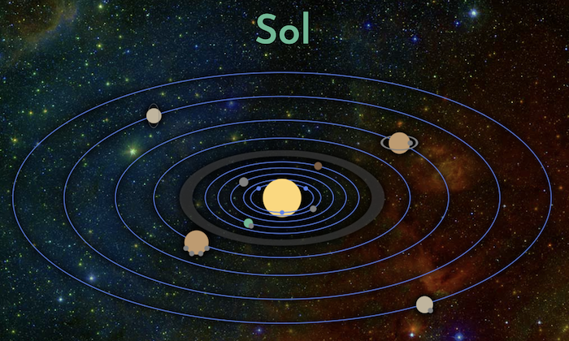

Stella Nauta represents the genesis of a new way of harnessing and exercising my creativity. This was the first major creative undertaking that I embarked on after committing to daily creative work. It's really incredible what you can accomplish with just a little bit of time every day.

For several years I worked on the high level concepts and underlying science for this fictional world. It is a hard sci-fi universe set ten thousand years in the future and I did a lot of research to approach it with as much realism as can be lent to far futurism. This included using [Wolfram Alpha](https://www.wolframalpha.com/) to identify star systems and calculate their distances and relative positioning. I also researched concepts like [time dilation](https://en.wikipedia.org/wiki/Time_dilation) when approaching the speed of light and calculated how badly the [Coriolis Force](https://en.wikipedia.org/wiki/Coriolis_force) would affect passengers of hypothetical ships and stations that utilize [centrifugal gravity](https://en.wikipedia.org/wiki/Centrifugal_force).

The culmination of my research and world building was [stellanauta.com](http://stellanauta.com/), where I introduce my universe and explore each of the star systems from a high level and through them, the divergent paths that humanity takes as we colonize the stars. These divergent paths follow each of the possible futures of humanity that have been envisioned by decades of futurism. Digital collectives, uploaded/downloaded consciousness, genetically engineered post-humans, synthetic life, and the singularity of super advanced artificial intelligence.

All of this helped to ground my fictional world in scientific principles that I felt would legitimize it and delineate some interesting possibilities but from there I had to make the leap from world building to storytelling. A fictional world is only as compelling as the stories told within it.

I started writing a novella that introduces a number of perspectives and viewpoints within the diverse universe. This was the largest written work I had ever attempted and as I worked I also read books on writing by some of my favorite authors and took courses in creative writing to dust off skills left neglected since my younger years.

Writing was difficult. I tried to let my first draft flow and postpone editing until it was finished but this just didn’t seem to work for me. On my best days I would be able to pour out a fair portion but I would always have to shape it immediately after in order to feel comfortable moving on. One of the experimental things I attempted was a genderless protagonist and invented gender neutral pronouns derived from they/their/them but shortened to ey/eir/em. This was difficult and though I eventually got the hang of it I don’t think it makes for accessible prose.

I would love to return to my novella and give it the second draft I feel it deserves. The story and characters show promise and I’m still in love with the universe and all of its possibilities. The experience of world building and then buckling down and actually utilizing the fictional world to create a finished and ambitious creative work was priceless. Perhaps I can share it here soon and continue the story that I hope will leave a reader wanting more.
