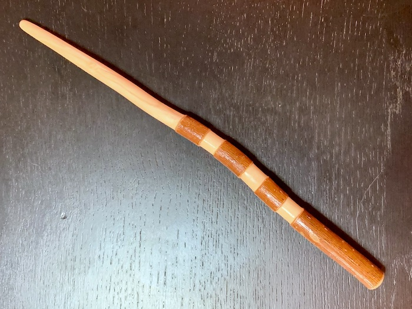
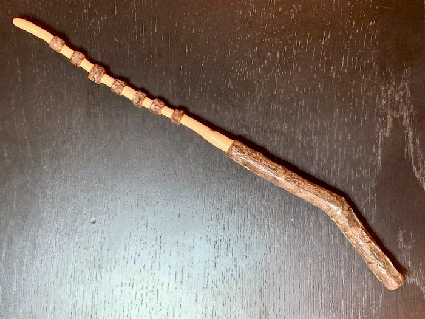
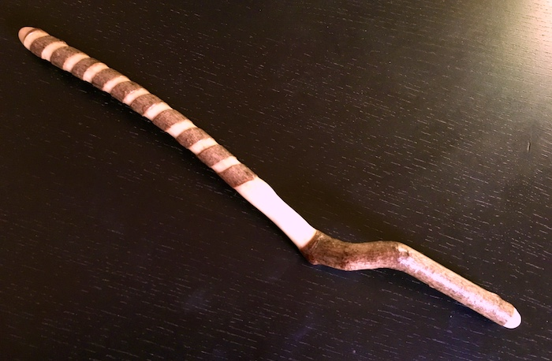
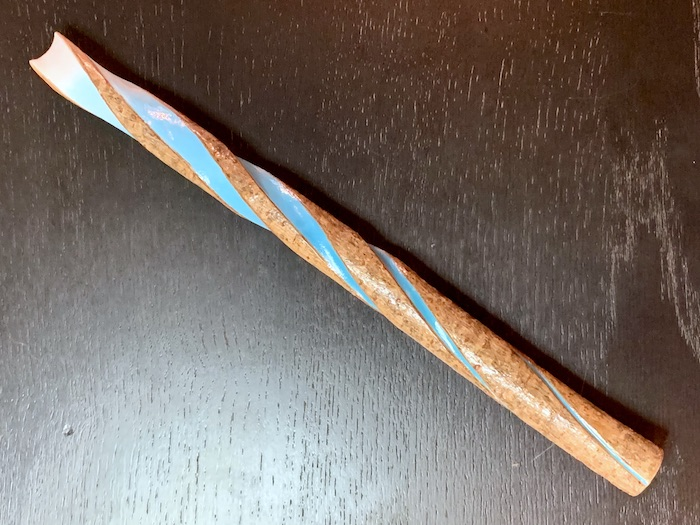

Carving wood has always been something inextricably linked with nature and adventure for me. Every Summer when I was young, my family would set out on an adventure to explore the National Parks across the country. When I was old enough to handle a knife my father introduced me to the art of whittling with the whale bone blade he brought back from Norway when he was a child.

On our hikes I learned to keep an eye out for likely sticks and staves that I could bring back to the camp fire and transform into something no longer solely of nature but not fully my creation either. It was a melding of the two, an act of artistic expression co-created with the natural world and a unique reminder of the trip and place where it was found.

A few years ago I revived my love of carving when I began taking trips into the wilderness once more. I decided to take my carvings a step further and finish them with fine blades, sand paper, and protective coats of polyacrylic. I carved wands and staves, inspired by my father's final staff where he left a beautiful section of bark to form a perfect handle. I found new and interesting ways to balance the bark with the wood beneath.

My latest wand began while Amanda and I explored the forest and cliffs surrounding Gunflint Lake while our son grew in her belly. I knew I wanted to find a beautiful piece of wood and carve a special wand for him and it presented itself as a storm-felled poplar that was perfect for the job. 

I attempted a challenging new pattern of spiraling cuts that tapered the full length of the wand. Once I had marked and begun the carving I realized I wanted to take it further and carve the cuts into concave channels that culminated in an inverted tip, accentuating the ends of the tapered bark spirals. 

The final touch was a step I had never taken with my carvings before, color. I have painted miniatures for many years and developed careful control and the ability to create smooth transitions and gradients. I wanted to create an effect like building energy concentrating in the tip of the wand and I'm very pleased with the final result. 

For now this will sit on Julian's shelf but someday I'll present his wand to him and tell him tales of magic and adventure.

