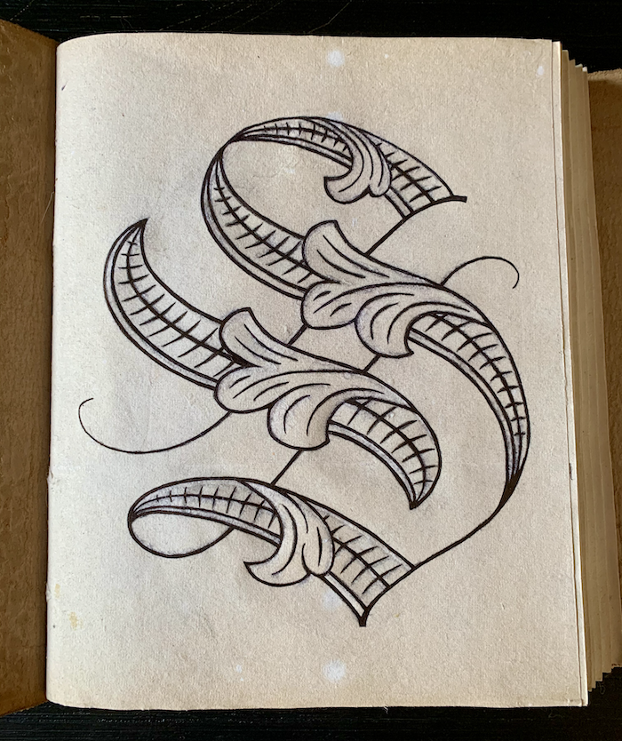

The Family Journal started as a wedding guest book but has grown to be much more. We got it from a hand-crafted book builder and thought it fit the theme and style perfectly for our wedding. The cover is hand tooled leather decorated by Celtic knot work and the pages are heavy and textured.

As a part of our wedding I created a Family Sigil based on that of an heirloom I inherited from my grandfather. I started the journal by inking the sigil onto the first page and then reserved the following pages for the wedding guests.

Within the first year of our marriage, as we worked to define what was important to us as a new family and what we wanted for our future, I created our Values Tree to articulate what is most important to us and help us prioritize our focus. These values were established and prioritized through individual contemplation and deep conversation.

My newest project for the Family Journal has been a series of pages that capture the secular Seasonal Celebrations that we are creating for our family now that Julian is born. We wanted to establish special days that mark the seasons yet avoid the baggage of religious holidays.

For these pages I started with a high level conceptual exploration of the seasons and created emblems that embody the cycle of growth through the year combined with the four elements. I did some research on traditional celebrations for each season and tried to distill them and combine them with what has been important for Amanda and I.

I wrote invocations for each of the Seasonal Celebrations that follow a pattern of setting the context, exploring how the coming season affects our life, and finishing with the way that we can celebrate it. The final touches for the pages was to create unique borders for each that also represent the turning of the year as they progress around the page.

