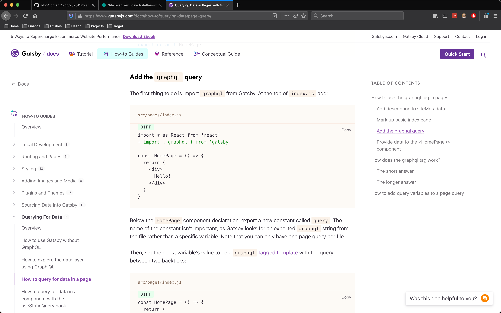
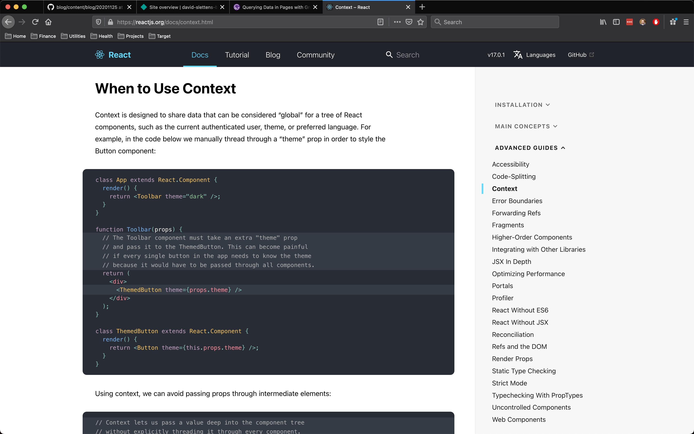
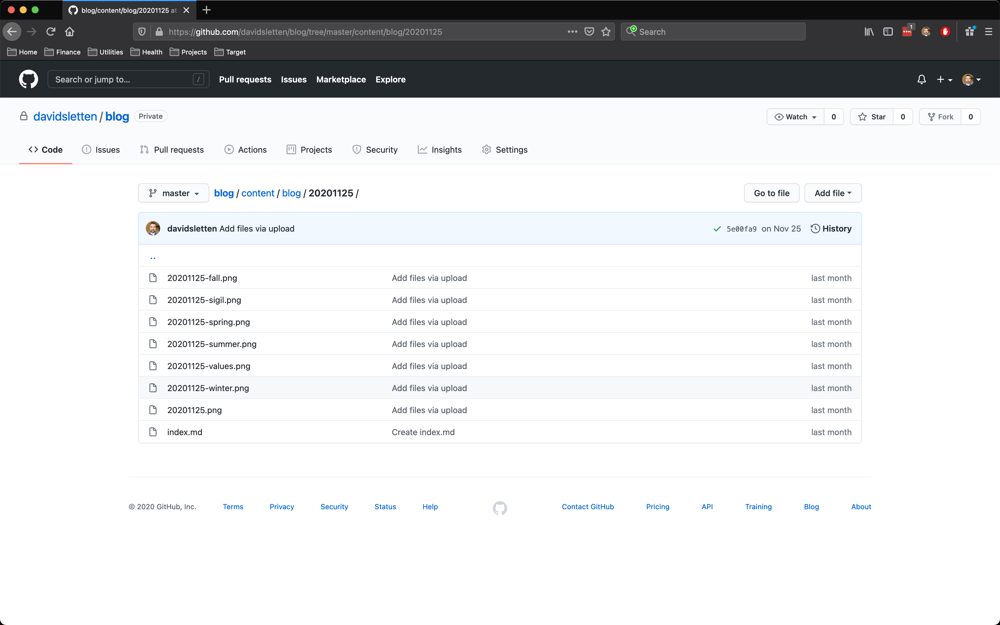
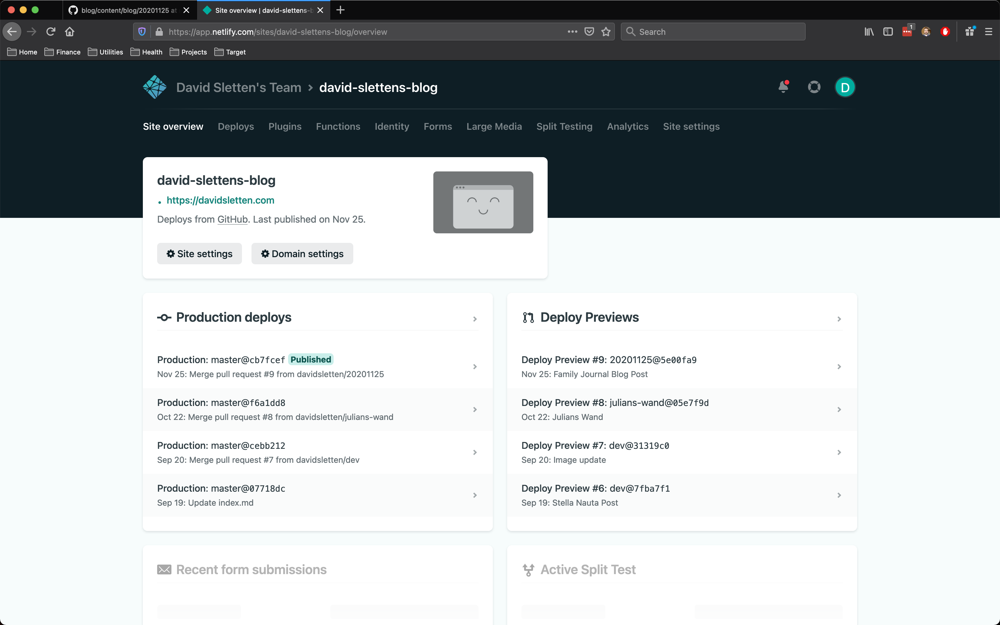

This blog is a sandbox for me to try new technologies and engineering patterns. I decided when it came time to move from design to development that I wanted to use it as an opportunity to explore a challenging tech stack that would push my professional abilities.

I also wanted to own every byte of code and data rather than depend on a platform or service. My first choice was the static site generating framework, [Gatsby](https://www.gatsbyjs.com/). This was something I’d been hearing about from my peers and mentors and wanted to explore. A static site generator is a piece of software that boils down a complicated web application into the simplest manifestation possible by crunching all of the code and outputting a set of html, css, and javascript that is optimized and simplified. This allows it to load extremely fast and run super smooth.

When I started coding my blog, I was using a javascript framework called [Vue](https://vuejs.org/) professionally and was getting pretty comfortable with it but the market was still dominated by [React](https://reactjs.org/). React is the most popular javascript framework in the world and I was familiar with it, but rusty. I chose to build with React so I could learn the new patterns that had emerged and found that it had evolved nicely in state management and component lifecycles.

One thing that building with Gatsby allowed me to explore was [GraphQL](https://graphql.org/) for manipulating data. I was able to write dynamic queries that update the header image of the page based on the post that is being loaded into the content area. This way of interacting with data was really exciting because previous protocols maintain control from the backend. GraphQL allows the frontend to shape and pull only what it needs. My Gatsby build uses this protocol to programmatically crawl my collection of posts and generate the pages for them. 

This tech stack and configuration allows me to write new posts in [Github](https://github.com/davidsletten/blog), right inside the browser, which are then published automatically as a part of the build and deploy pipeline that I have set up. I use a service called [Netlify](https://www.netlify.com/) to watch my Github repository and automatically build and deploy the new static site that is output every time I write a new post. What this means is that using the simplest of interactions and with a bare minimum of code and complexity I’m able to host and publish my blog quickly and easily.

