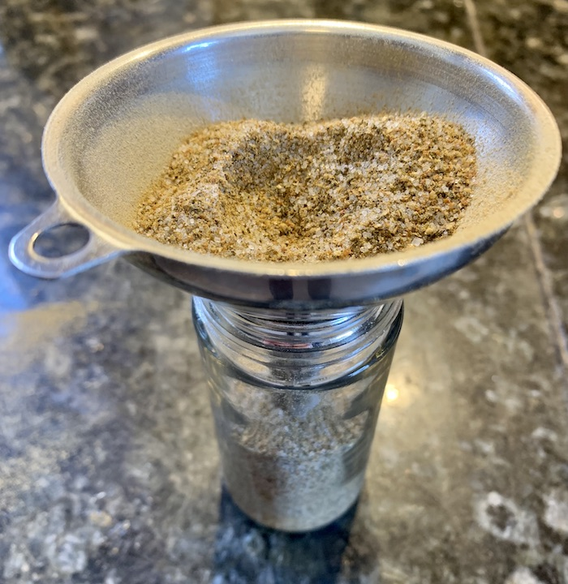
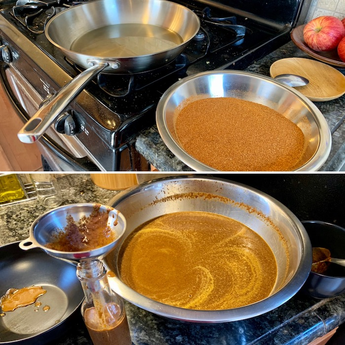
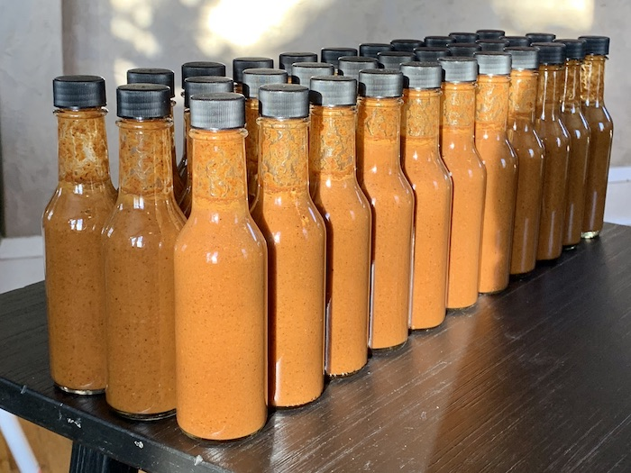
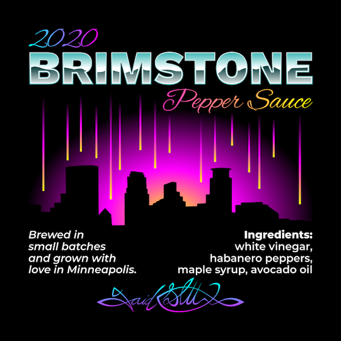
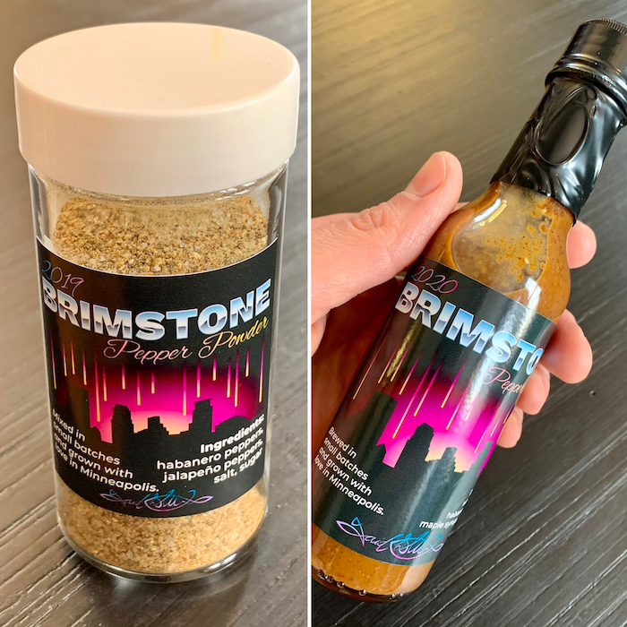

My newest batch of Brimstone Pepper Sauce is complete, and with it a new experiment, Brimstone Pepper Powder. 2019 was a busy year for us with the birth of our first child and I paired back the garden to make it easier to manage. With less peppers and a combination of jalapeños and habaneros, 2019's harvest wasn't ideal for it's own batch of pepper sauce so I let the dried peppers sit until this year when I decided to try my hand at a seasoning mix.

To stay on brand with my pepper sauce I wanted the mix to be spicy, sweet, and simple, so I decided to go with three parts pepper powder, two parts salt, and one part sugar. It actually turned out really well and I ordered spice jars that I even branded with a unique label, though I did stick with the new 2020 graphic instead of giving them their own.

2020, on the other hand, was the perfect year to garden... for reasons. I ramped up the habanero presence and pulled a nice sized harvest that I dried in the dehydrator and packed away for the winter holiday break. It was a nice vacation this year with lots of time for projects and hanging out with Amanda and Julian. On the last day of vacation I donned my gas mask, gloves, and shooed the family out of the kitchen.

Brewing hot sauce is unavoidable noxious. We even had to shut the heat off so the HVAC wouldn't pump pepper bombed air into the nursery while Julian slept. This year I was feeling confident about my process but decided to finally codify it so that I can remember the proportions. When the toxic dust settled I had brewed thirty three new bottles of hot sauce. I could have potentially gotten more if I diluted it but one thing I insist on is a potency that is very difficult to match.

I knew I wanted to update the branding this year but I like a lot of what I established with Brimstone 2018 so I kept much of the label and just created a new graphic for the center. I thought about all that had happened in 2020 but thought it would be disrespectful to make any overt references so I went back to the roots of why I named my hot sauce Brimstone in the first place and created a graphic of the skyline of Minneapolis beset by fire and brimstone from the sky. I feel like it captures the year and also my brand. 

