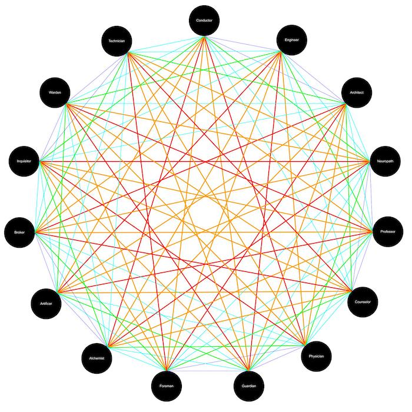
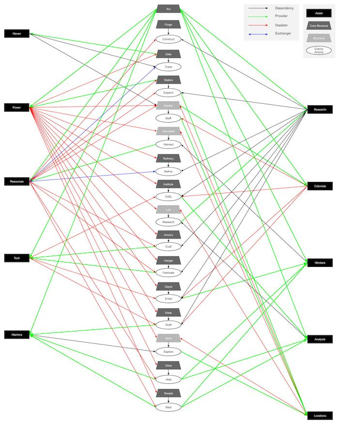
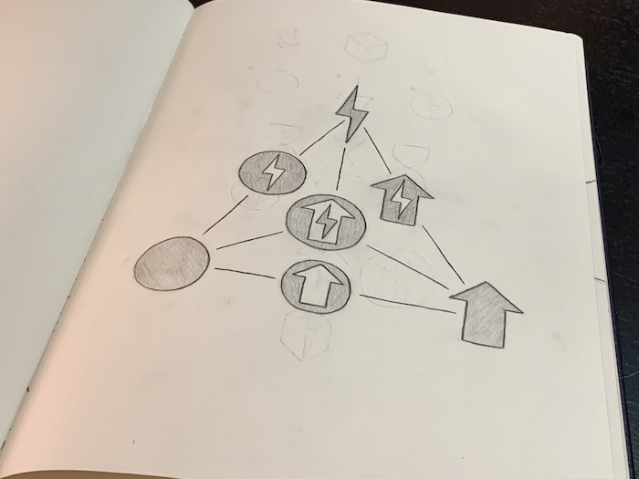

Æthomancer is the most ambitious creative project I've ever embarked on. With it I'm attempting to create an epic tabletop gaming experience that combines the narrative character driven aspects and exploration of role-playing games with the system building and customizing aspects of worker placement economy games.

I've always loved immersive gaming experiences as well as the thrill and challenge of economy builders and wanted to try my hand at designing the game that I've always dreamed about playing but never found. To me, the most engaging role-playing experiences are the ones that provide just the right level of prompt and guidance but then the flexibility to really respond and show character.

One of the most important aspects about table-top gaming for me is the social aspect. Tabletop games act as a focus and facilitator for engaging social interactions with friends and family. To play with the social aspect I created a complex relationship system between the cast of characters for my game. This necessitated creating a fixed cast of characters rather than allowing complete freedom in character creation but opens the door to much more personal stories and interactions.

The relationship system allows players to develop relationships with other characters, whether they be other players or NPCs that can range from friendship to rivalry, or even romance. One of the fun things about designing this system was that I could make it much more volatile than other systems. Where facing the main challenges of the game needs to be rewarded with steady progression, it's ok for relationships to wax and wane from one session to another. This provides a different type of challenge in navigating the uncertainty of a relationship with another character and makes the rewards and benefits of achieving a high level of friendship all the more satisfying. 

Competitive board games can be a bit stressful sometimes and even unenjoyable depending on how hard the game pits players against each other but cooperative games can sometimes lack the same level of engagement and excitement especially if one player dominates decisions. I chose to create a game that is both competitive and cooperative to try and include the best parts of each. Players work together to overcome challenges but at the same time are competing for how well they address them and are rewarded for their efforts.

Another important thing for me when designing this game and possibly the most difficult was to take the focus of challenges away from strictly combat. Combat is an easy challenge and an exciting foundation for games but too much of our games and stories focus on violence as the solution to our problems and I wanted to find a different way. To accomplish this I created a system of attributes that describe each character as well as each challenge they may face. These attributes are focus, finesse, and fortitude and with them I can create not only a diverse cast of characters with different strengths and weaknesses but also a variety of challenges that don't necessarily need to focus on combat.

Some examples of non-combat challenges that could be created from combining these attributes are:
- Diagnosing a disease spreading through the colony and synthesizing the cure in time to save everyone in the cast and as many colonists as possible (Focus).
- Social engagement with an alien species (Finesse).
- Repairing a malfunctioning structure or piece of technology that is dangerous and time sensitive (Fortitude).

