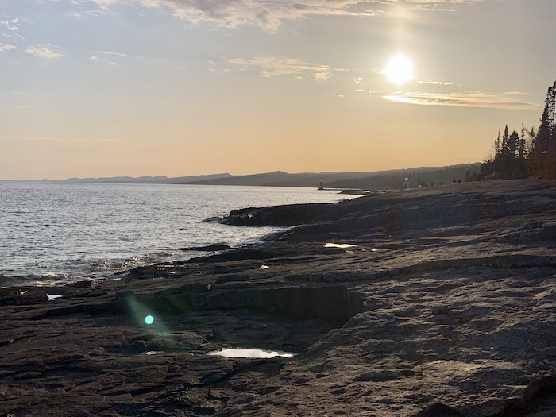
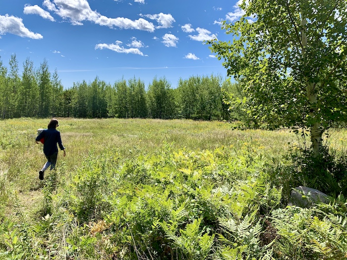
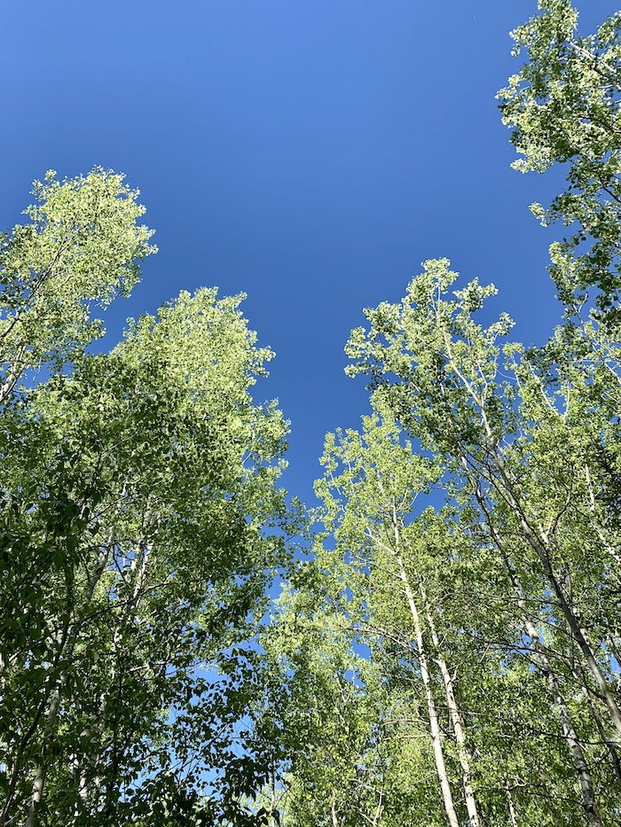
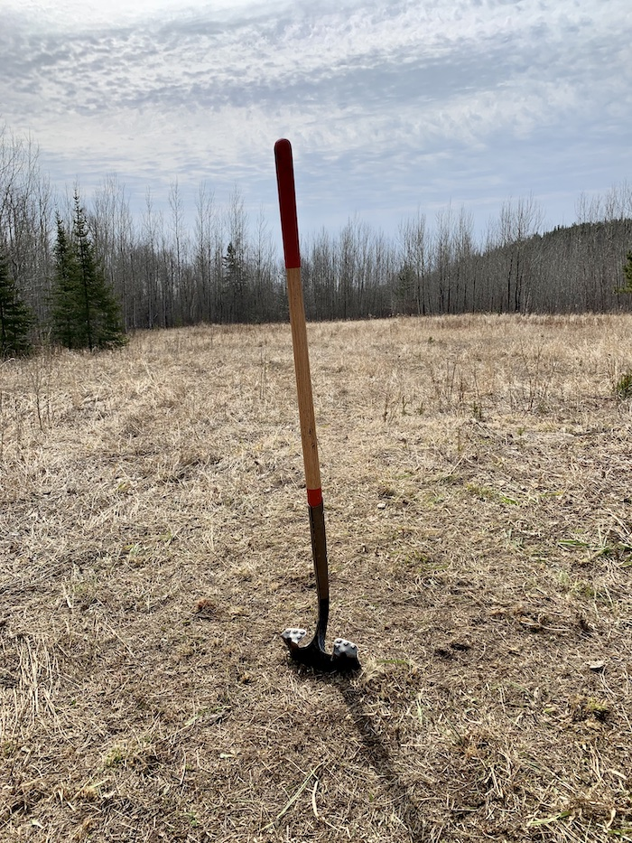
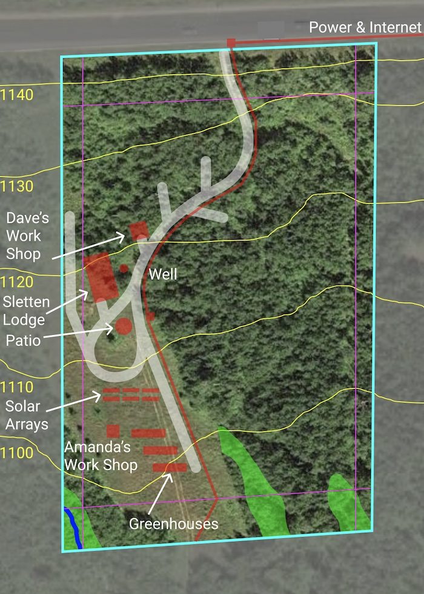
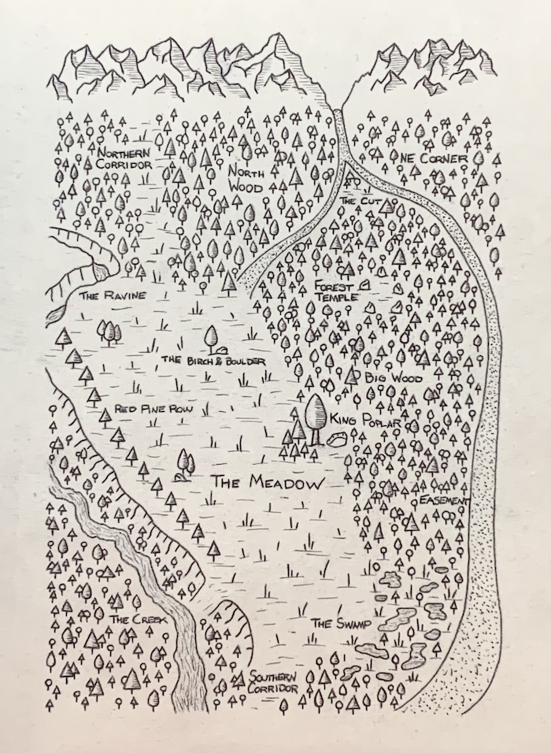

When the world was young there was a great mountainous continent named Laurentia. As the aeons passed, the mountains wore down until their very roots rose to the surface and ruptured, splitting the land with the deepest volcanic rift to ever be. After an age buried beneath ice, this land filled in with the largest fresh water lake in the world while it's shores covered over with the great boreal forest that rings the planet like a crown. This is the place where I hope to build a future for my family.

The Meadow is our name for the plot of land that we bought in the hills above the north shore of Lake Superior. It is five acres of birch and pine punctuated by a rolling meadow with views of the lake and the ridgeline of the ancient Sawtooth mountains.

For years we have dreamed of making a place of our own up there and every time we made the trek to visit or adventure it was harder to tear ourselves away and return home. All the way down the shore we would discuss what it would look like to stay and how we could make it work.

When the pandemic struck, it changed everything. For the first time it was not only possible, but likely that I could continue my work remotely. We had already started exploring the previous summer and learning all we could of what it would take to live up there. We weren't the only ones looking but since we were already prepared we were able to beat the rush and find the perfect plot.

Since securing the land we have been busy planning our future there and taking the first tentative steps to develop it. We've carved a driveway through the forest to our meadow and worked with our neighbors to bring power and internet to our corner of the North Shore. We are currently selling our house in NE Minneapolis and taking stock of our life as we prepare to build our new home.

I have already begun to weave a mythos for our new home and crafted a map, with a few creative embellishments, that puts names to our land. Our plan includes many years and phases of development beyond the first and most important, which is our lodge. We hope to start building soon and until then are busy preparing ourselves, our family, and our land for the adventure we will share together.

